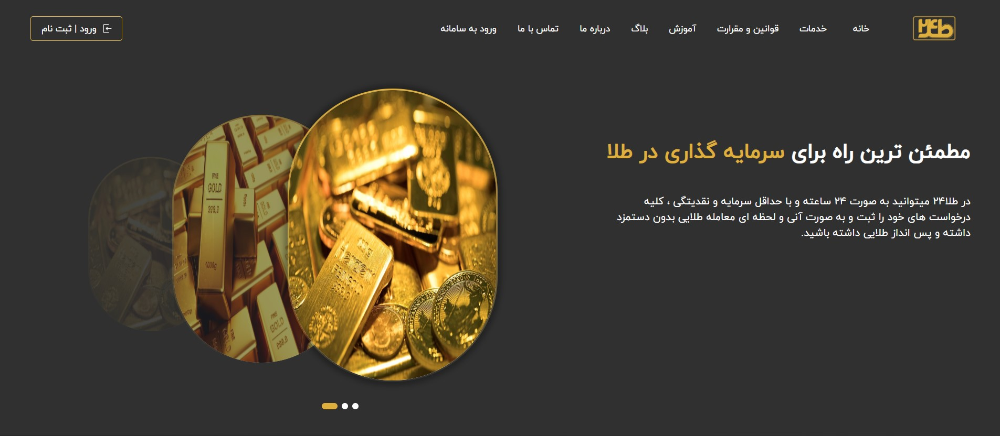
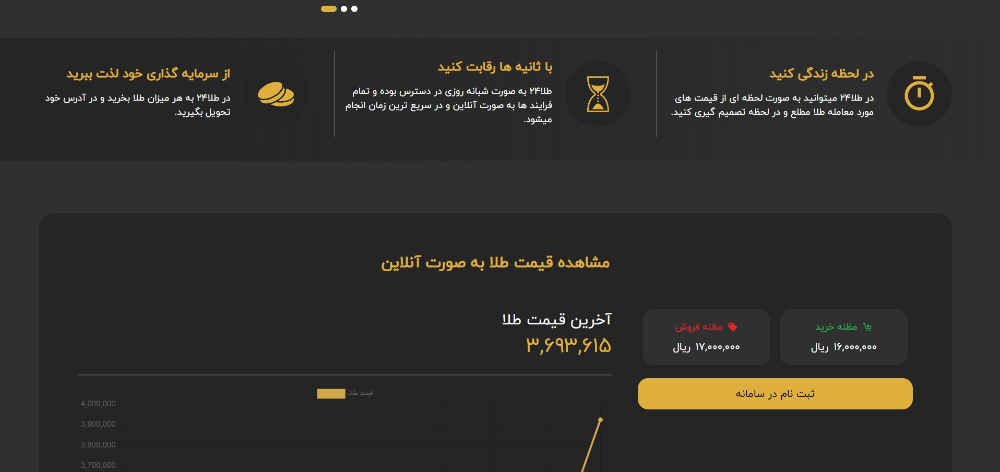
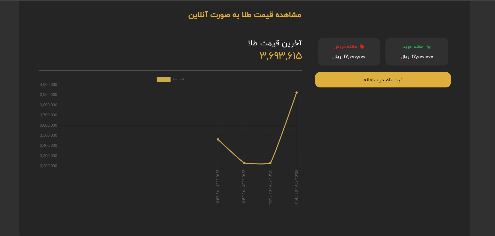
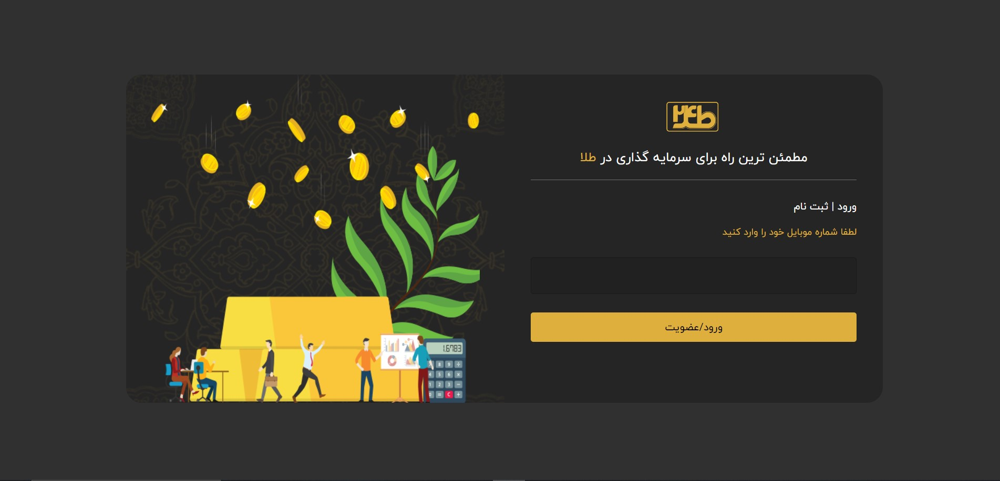
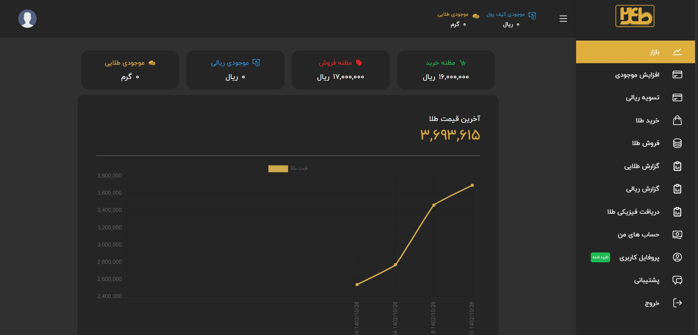
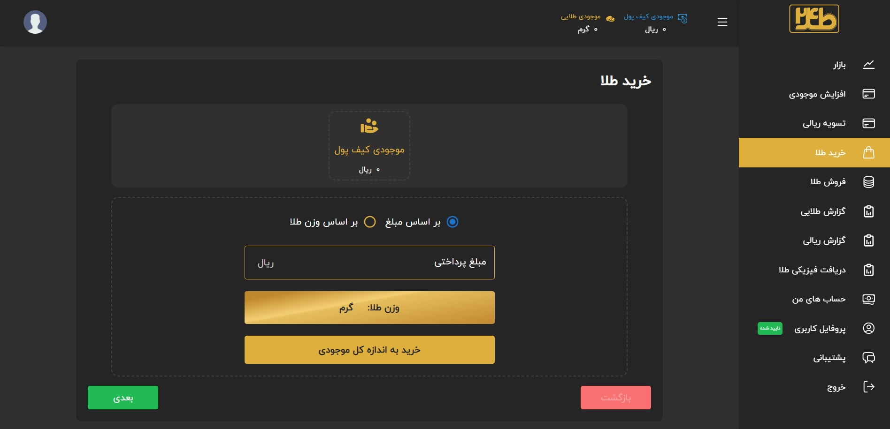
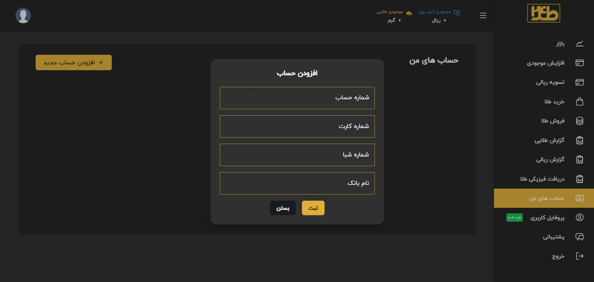
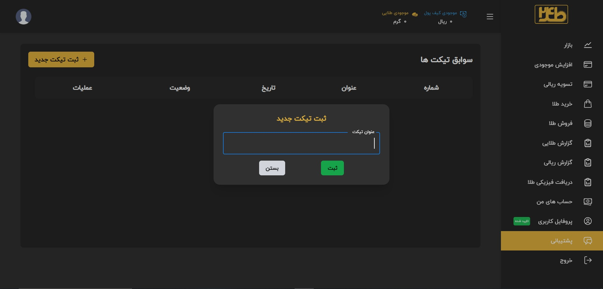
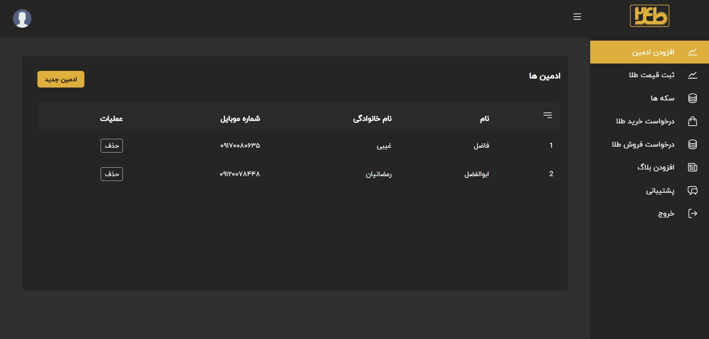

# Tala24

## Overview
Tala24 is an advanced management system designed for the purchase and sale of warm gold. This system streamlines operations, ensuring efficient and secure transactions within the gold trading industry.

## Features
- **Efficient Transaction Management**: Facilitates seamless purchase and sale processes.
- **Security**: Ensures secure transactions to protect both buyers and sellers.
- **User-Friendly Interface**: Easy to navigate interface for a better user experience.
- **Real-Time Data**: Provides real-time data updates and analytics.

## Tech Stack
- **React**: For building user interfaces.
- **Bootstrap**: For responsive design and layout.
- **Chart.js**: For data visualization and interactive charts.
- **Axios**: For making HTTP requests.
- **Yup**: For form validation.
- **Webpack**: For module bundling.
- **Material UI**: For modern UI components.

## UI Screenshot

## License

This project is licensed under the MIT License - see the [LICENSE](LICENSE) file for details.

*Note: Replace `path_to_your_logo_image.png` with the actual path to your project's logo image. Also, replace the repository URL and contact email with your actual details.*